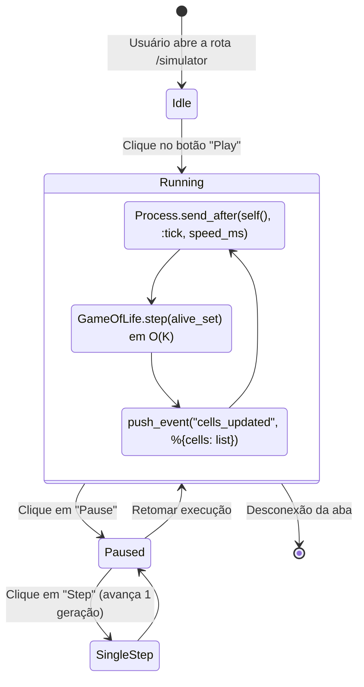
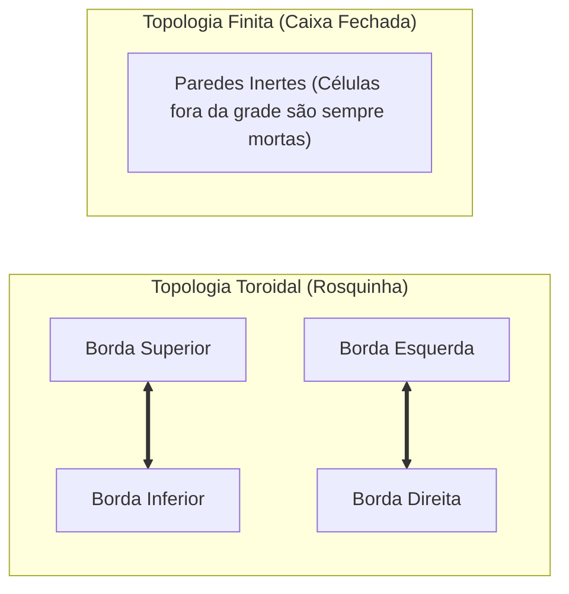

Autômatos celulares são sistemas fascinantes onde regras locais incrivelmente simples geram comportamentos globais de complexidade surpreendente. Desde as formulações pioneiras de **Stanislaw Ulam** e **John von Neumann** na década de 1940 até a criação do célebre **Jogo da Vida** (*Conway's Game of Life*) por John Conway em 1970, esses modelos matemáticos servem como base para estudos de auto-replicação, teoria do caos e computação universal.

Para explorar esses conceitos de forma visual e intuitiva, desenvolvi o **Automaton**: um laboratório interativo construído com **Elixir 1.18** e **Phoenix LiveView 1.1**, publicado na nuvem da Fly.io.

---

## 1. O Dilema Arquitetural: Servidor ou Cliente?

A vasta maioria dos simuladores de autômatos celulares na web delega toda a computação ao JavaScript do navegador. No Automaton, decidi adotar uma abordagem intencionalmente contrária: **a simulação é executada no servidor, dentro do processo da máquina virtual BEAM**.

Essa decisão arquitetural oferece vantagens significativas:
- **Estado Canônico e Concorrência:** Cada sessão possui seu próprio processo isolado e imutável, protegido por supervisão OTP.
- **Histórico Populacional Confiável:** Métricas de população e gerações são calculadas com determinismo estrito sem sofrer desvios causados por throttling de abas no cliente.
- **Eficiência de Conexão:** O Phoenix LiveView mantém um canal WebSocket leve que transmite apenas as deltas de coordenadas atualizadas.

---

## 2. A Otimização Algorítmica: De $O(R \times C)$ para $O(K)$ Esparso

Em uma grade com dimensões $50 \times 65$ (3.250 células), uma implementação ingênua em matriz bidimensional precisa iterar sobre todas as 3.250 posições a cada nova geração. Quando a simulação roda a 20 ou 30 gerações por segundo, o custo computacional cresce linearmente com a área da tela, mesmo que haja apenas 10 células vivas em um canto.

No Automaton, modelamos o universo como um **conjunto esparso** utilizando o módulo `MapSet` de tuplas `{linha, coluna}`:

```elixir
defmodule Automaton.GameOfLife do
  @moduledoc "Motor do Jogo da Vida de Conway com grade esparsa toroidal."

  def step(alive, rows, cols, wrap \\ true) do
    alive
    |> Enum.flat_map(fn {r, c} -> neighbors(r, c, rows, cols, wrap) end)
    |> Enum.frequencies()
    |> Enum.filter(fn {cell, count} ->
      count == 3 or (count == 2 and MapSet.member?(alive, cell))
    end)
    |> Enum.map(fn {cell, _} -> cell end)
    |> MapSet.new()
  end

  defp neighbors(r, c, rows, cols, true) do
    for dr <- -1..1, dc <- -1..1, {dr, dc} != {0, 0} do
      {rem(r + dr + rows, rows), rem(c + dc + cols, cols)}
    end
  end
end
```

### Análise Matemática da Eficiência

Ao usar `Enum.flat_map` mapeando apenas a vizinhança das células atualmente vivas e agrupando com `Enum.frequencies`:
1. Uma célula morta que não tem nenhum vizinho vivo sequer é visitada pela função.
2. O algoritmo opera em complexidade proporcional a $O(K)$, onde $K$ é o número de células vivas, e **não** sobre a área total $R \times C$.
3. Se houver 30 células vivas em uma grade de 10.000 posições, o motor avalia apenas os arredores daquelas 30 células, reduzindo o tempo de cálculo para frações de microssegundo na BEAM.

---

## 3. Máquina de Estados e Loop de Ticks no LiveView

O controle de reprodução (Play, Pause, Step, Clear, Random) é gerido por mensagens assíncronas do Erlang OTP:



---

## 4. Renderização a 60 FPS com Hooks de Canvas em JavaScript

Para garantir que a animação seja perfeitamente fluida e não cause engasgos de reconciliação de DOM, não renderizamos as células com elementos HTML (`<div>` ou `<td>`).

Em vez disso, utilizamos um **Hook de JavaScript** do Phoenix LiveView conectado a um elemento `<canvas>`:

```javascript
Hooks.Canvas = {
  mounted() {
    this.canvas = this.el;
    this.ctx = this.canvas.getContext("2d");
    
    this.handleEvent("cells_updated", ({ cells }) => {
      requestAnimationFrame(() => {
        this.renderGrid(cells);
      });
    });
  },
  
  renderGrid(cells) {
    this.ctx.clearRect(0, 0, this.canvas.width, this.canvas.height);
    // Desenho otimizado em lote de cada célula viva
    this.ctx.fillStyle = "#6366f1";
    for (const [r, c] of cells) {
      this.ctx.fillRect(c * this.cellWidth, r * this.cellHeight, this.cellWidth - 1, this.cellHeight - 1);
    }
  }
};
```

Esse padrão combina o melhor dos dois mundos: **computação e autoridade de estado no servidor Elixir**, e **desenho direto na placa gráfica pelo navegador via Canvas API**.

---

## 5. Topologias e Biblioteca de Padrões Clássicos

O Automaton suporta duas topologias espaciais distintas:
- **Toroidal:** O universo se fecha sobre si mesmo — uma célula que sai pela direita reaparece na esquerda; se sobe pelo topo, reaparece na base.
- **Borda Finita:** O universo tem paredes rígidas, e células que tocam a extremidade são desprovidas de vizinhos além da margem.



O estúdio inclui presets para padrões clássicos históricos:
- **Osciladores:** *Blinker* (período 2), *Toad*, *Beacon* e *Pulsar* (período 3).
- **Naves Espaciais:** *Glider* (desloca-se diagonalmente pelo espaço).
- **Canhão de Gliders:** *Gosper Glider Gun* (emite projéteis indefinidamente).
- **Metusalém:** *R-pentomino* (uma semente de 5 células que evolui por mais de 1.100 gerações antes de se estabilizar).


---

## 6. Conclusões

O projeto comprova a robustez e versatilidade da stack **Elixir / Phoenix LiveView** para simulações e sistemas em tempo real:
- Código expressivo, legível e puramente funcional no motor matemático.
- Consumo mínimo de memória e CPU mesmo com simulações contínuas de alta frequência.
- Demonstração prática de que sistemas web modernos podem entregar interatividade rica mantendo a simplicidade de arquitetura.
