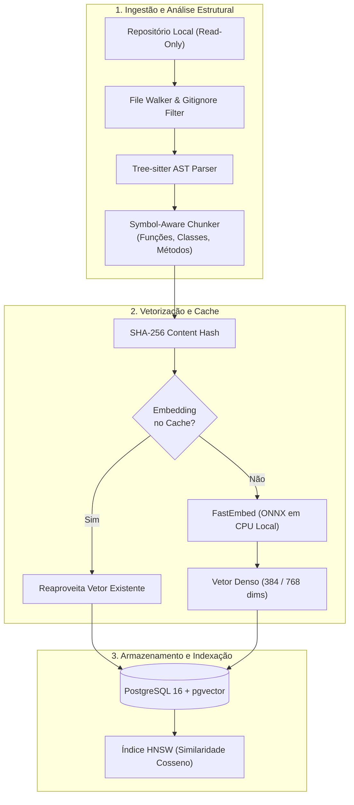
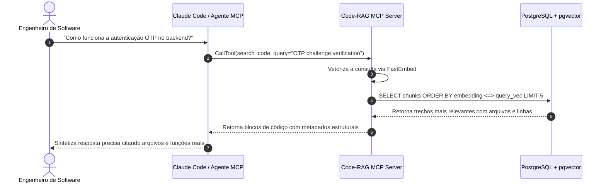

A recuperação de informações contextualizada em grandes bases de código é um dos maiores desafios na construção de agentes autônomos e assistentes de programação modernos. Ferramentas tradicionais baseadas em busca lexical, como o `grep` ou o `ripgrep`, são excepcionalmente rápidas, mas falham categoricamente quando a dúvida do engenheiro envolve semântica abstrata: *"onde gerenciamos a renovação rotativa de tokens?"* ou *"qual componente orquestra as tarefas em segundo plano?"*.

Para solucionar esse problema, concebi e desenvolvi o **Code-RAG**: uma implementação de referência, aberta e autocontida, voltada para busca semântica em repositórios locais através de uma interface web interativa, uma API REST em FastAPI e um servidor padronizado via **Model Context Protocol (MCP)**.

---

## 1. O Fracasso das Abordagens Ingênuas de Chunking

A maioria dos tutoriais de RAG (Retrieval-Augmented Generation) para texto puro divide documentos em blocos fixos de caracteres ou contagem arbitrária de tokens (por exemplo, pedaços de 500 tokens com 50 de sobreposição). Em bases de código-fonte, essa abordagem é desastrosa:

1. **Quebras Sintáticas:** Um bloco cortado aleatoriamente pode começar no meio de um loop `for` e terminar antes da declaração de retorno, destruindo a estrutura de escopo e variáveis.
2. **Perda de Contexto de Assinatura:** O corpo de uma função perde a visibilidade de seus parâmetros e decoradores.
3. **Fragmentação de Classes:** Métodos de uma mesma classe ficam espalhados sem qualquer vínculo estrutural.

No Code-RAG, substituímos o chunking cego pela **análise sintática com Tree-sitter**, analisando as árvores sintáticas abstratas (ASTs) de cada linguagem para isolar nós completos de funções, métodos e structs.



---

## 2. Vetorização na CPU com FastEmbed e Modelos ONNX

Um dos principais requisitos de projeto era a **independência de provedores externos pagos** para o pipeline de indexação primário. Depender de APIs proprietárias de embeddings para indexar repositórios inteiros introduz custos contínuos, latência de rede e riscos de privacidade empresarial.

Utilizamos a biblioteca **FastEmbed**, que executa modelos otimizados no formato ONNX diretamente na CPU através de instruções SIMD/AVX:

- **Modelo Padrão:** `BAAI/bge-small-en-v1.5` gerando vetores densos de 384 dimensões.
- **Eficiência:** Velocidades de processamento superiores a 150 trechos de código por segundo em hardware comum sem necessitar de placas de vídeo dedicadas.
- **Arquitetura Plugável:** O sistema suporta a troca dinâmica para instâncias locais do Ollama ou provedores remotos compatíveis com OpenAI e Google Gemini.

```python
from fastembed import TextEmbedding

class LocalEmbeddingProvider:
    def __init__(self, model_name: str = "BAAI/bge-small-en-v1.5"):
        self.client = TextEmbedding(model_name=model_name)

    def embed_chunks(self, texts: list[str]) -> list[list[float]]:
        # Execução vetorial multithread na CPU com aceleração ONNX
        embeddings = list(self.client.embed(texts))
        return [e.tolist() for e in embeddings]
```

---

## 3. Persistência Vetorial com pgvector e Índices HNSW

Para o armazenamento vetorial e cálculo de distância de cosseno, integramos o PostgreSQL 16 com a extensão **pgvector**. Em vez de buscas exatas lineares $O(N)$ que degradam rapidamente com o crescimento da base, configuramos índices aproximados **HNSW (Hierarchical Navigable Small World)**:

```sql
CREATE TABLE code_chunks (
    id UUID PRIMARY KEY DEFAULT gen_random_uuid(),
    project_name TEXT NOT NULL,
    file_path TEXT NOT NULL,
    symbol_name TEXT,
    language TEXT NOT NULL,
    start_line INTEGER NOT NULL,
    end_line INTEGER NOT NULL,
    content_hash TEXT NOT NULL,
    content TEXT NOT NULL,
    embedding vector(384) NOT NULL
);

CREATE INDEX idx_chunks_hnsw ON code_chunks 
USING hnsw (embedding vector_cosine_ops)
WITH (m = 16, ef_construction = 64);
```

### Otimização com Deduplicação e Transações Atômicas

Para garantir que reindexações não causem sobrecarga desnecessária:
- Cada bloco recebe um hash `SHA-256` de seu conteúdo normalizado. Se o código não mudou, o vetor existente é reaproveitado sem recomputação.
- A substituição do índice de um projeto é executada dentro de uma **transação SQL atômica**, evitando leituras parciais enquanto a indexação estiver em andamento.

---

## 4. Integração com Agentes de IA via Model Context Protocol (MCP)

O Code-RAG não foi planejado apenas para leitura humana: sua função mais poderosa é atuar como um **servidor MCP** conectado a assistentes autônomos de desenvolvimento, como o Claude Code e o Cursor.



O protocolo expõe três ferramentas de alta fidelidade:
1. `search_code`: Busca semântica por intenção e linguagem natural.
2. `find_symbol`: Localização direta de definições de símbolos (funções, classes, interfaces).
3. `list_projects`: Descoberta dos índices disponíveis no sistema.

---

## 5. Interface Gráfica e Documentação Interativa

Além da camada de serviço, o projeto conta com uma interface visual interativa completa para que qualquer pessoa compreenda as etapas internas do pipeline de IA:


A interface inclui filtros por projeto, destaque de sintaxe, medição em milissegundos do tempo de recuperação e uma página didática com visualizações manipuláveis do espaço vetorial.

---

## 6. Conclusões e Resultados

A combinação de **Tree-sitter + FastEmbed + pgvector + MCP** provou ser uma arquitetura equilibrada para bases de código privadas:
- **Custo Operacional Zero:** Sem faturas mensais de APIs de embeddings para uso diário.
- **Latência de Recuperação:** Menos de 45 ms para consultas em bases com mais de 30.000 linhas de código.
- **Rigor Sintático:** LLMs recebem blocos de código semanticamente íntegros, reduzindo alucinações e acelerando fluxos de desenvolvimento.
