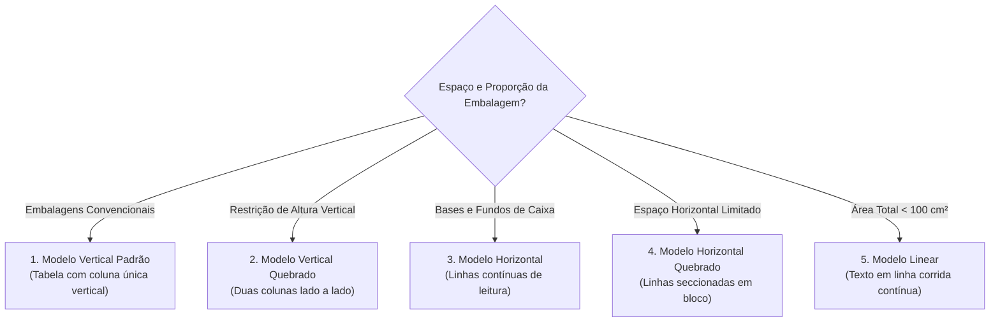

A entrada em vigor das novas normas de rotulagem nutricional da Agência Nacional de Vigilância Sanitária (**Anvisa**), consolidadas pela **RDC nº 429/2020** e pela **Instrução Normativa nº 75/2020**, estabeleceu um padrão técnico rigoroso para a declaração de nutrientes no Brasil. Para a indústria de alimentos de grande porte com equipes dedicadas de P&D, a adaptação foi uma questão de tempo; para pequenos produtores artesanais, padarias, confeitarias e nutricionistas, tornou-se uma barreira burocrática e financeira intimidadora.

Para atender a essa demanda pública sem barreiras comerciais, desenvolvi o **Kcal**: uma ferramenta web aberta, gratuita e sem necessidade de cadastro, capaz de gerar os modelos oficiais de rótulos da Anvisa a partir de bases científicas laboratoriais (Tabela TACO da UNICAMP).

---

## 1. Filosofia Arquitetural: A Abordagem "One-Shot"

No desenvolvimento SaaS tradicional, o instinto primário é exigir um cadastro com e-mail e senha e persistir cada receita inserida em um banco de dados relacional centralizado. No Kcal, tomamos deliberadamente o caminho oposto: **Zero Persistência no Servidor**.

### Por Que a Persistência Zero é Superior Nesse Cenário?

1. **Privacidade Absoluta:** O usuário pode formular receitas comerciais e fórmulas industriais confidenciais com a tranquilidade de que nenhum dado trafega para armazenamento permanente de terceiros.
2. **Custo e Complexidade Zero de Infraestrutura:** Não há necessidade de gerenciar bancos com backups incrementais, políticas de expiração de dados, retenção de LGPD ou escalabilidade de escrita.
3. **Resiliência e Segurança Extrema:** O banco de dados do servidor é um arquivo SQLite configurado em **modo estritamente somente-leitura** (`file:taco.db?mode=ro`). Não existe nenhuma rota de mutação de dados exposta ao público.

```mermaid
flowchart LR
    subgraph Cliente ["1. Sessão do Navegador (Volátil)"]
        FormInput["Entrada de Ingredientes, Medidas e Rendimento"]
        LiveState["Estado na RAM do Processo LiveView"]
        PNGExport["Exportação de Imagem PNG (html-to-image)"]
        LocalJSON["Backup Local em JSON (Download / Upload)"]
        FormInput <--> LiveState
        LiveState --> PNGExport
        LiveState --> LocalJSON
    end

    subgraph Servidor ["2. Fly.io MicroVM (Elixir / BEAM)"]
        LiveViewProc["LiveView Process"]
        AnvisaEngine["Motor Normativo RDC 429 / IN 75"]
        ReadOnlyDB[("SQLite TACO (Mode: RO)\n597 Alimentos Oficiais")]
        LiveState <==>|Canal WebSocket TLS| LiveViewProc
        LiveViewProc --> AnvisaEngine
        AnvisaEngine -->|Busca O(1) sem locks| ReadOnlyDB
    end
```

---

## 2. Modelagem Funcional das Regras Sanitárias em Elixir

A conversão da norma sanitária em código funcional exige precisão matemática. Cada ingrediente adicionado tem sua composição escalada a partir de sua proporção de 100 gramas ou mililitros comestíveis:

$$\text{Nutriente}_{\text{receita}} = \sum_{i=1}^{N} \left( \frac{\text{Qtd}_i \times \text{FatorConversao}_i}{100} \right) \times \text{ValorBase}_i$$

O cálculo dos **Valores Diários (%VD)** obedece à referência mandatória de uma dieta de 2.000 kcal:
- **Valor Energético:** 2.000 kcal
- **Carboidratos:** 300 g (Açúcares totais: sem %VD; Açúcares adicionados: 50 g)
- **Proteínas:** 50 g
- **Gorduras Totais:** 65 g (Gorduras saturadas: 20 g; Gorduras trans: 2 g sem %VD)
- **Fibra Alimentar:** 25 g
- **Sódio:** 2.000 mg

```elixir
defmodule Kcal.Calculator do
  @doc "Calcula os totais e percentuais com base na porção informada."
  def calculate_portion(recipe_nutrients, total_weight_g, portion_size_g) do
    factor = portion_size_g / total_weight_g

    recipe_nutrients
    |> Enum.map(fn {nutrient, total_val} ->
      portion_val = total_val * factor
      vd_percent = calculate_vd(nutrient, portion_val)
      {nutrient, %{value: portion_val, vd: vd_percent}}
    end)
    |> Map.new()
  end
end
```

---

## 3. Os 5 Modelos Oficiais de Rotulagem da Anvisa

A norma da Anvisa não impõe um layout único; ela define cinco diagramações obrigatórias adequadas a diferentes embalagens:



Além da tabela, o sistema avalia os critérios de **Rotulagem Nutricional Frontal (FOP)**: o infame selo da lupa preta *"ALTO EM GORDURA SATURADA"* e *"ALTO EM SÓDIO"*, exibido quando os teores ultrapassam os limites de 6 g de gordura saturada ou 600 mg de sódio por 100 g de alimento sólido.

---

## 4. O Painel em Produção e Geração de Artefatos

O resultado é renderizado com precisão tipográfica rigorosa (famílias tipográficas sans-serif neutras, linhas de 0.5 pt e contrastes mínimos exigidos pelos manuais de fiscalização):


A exportação é realizada via biblioteca `html-to-image`, gerando arquivos PNG nítidos com fator de escala 2x ou 3x prontos para inserção em softwares de diagramação vetorial (como Adobe Illustrator ou Figma).

---

## 5. Conclusão

O projeto Kcal demonstra que o alinhamento cuidadoso entre **arquitetura de sistemas (banco read-only, estado volátil)** e **modelagem funcional rigorosa** é capaz de criar ferramentas de utilidade pública duráveis, sustentáveis e sem qualquer custo de manutenção perpétuo.
