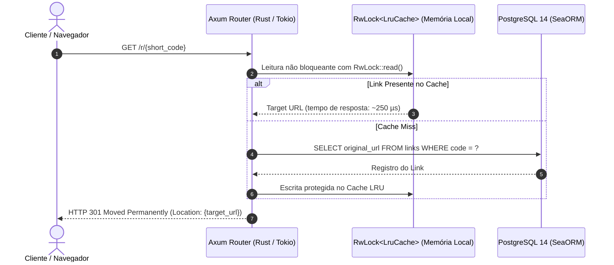
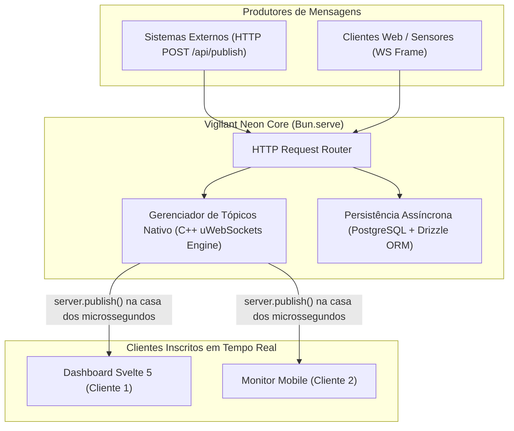

Na arquitetura de sistemas distribuídos contemporânea, o tempo de resposta em operações críticas de roteamento e mensageria não é apenas uma métrica de vaidade — ele impacta diretamente a retenção de usuários, a vazão máxima de conexões simultâneas e os custos operacionais com servidores.

Para explorar os limites da latência ultrabaixa e do baixo consumo de recursos, desenvolvi dois projetos complementares em ecossistemas de alta performance:
1. **Quark Shift:** Microsserviço de encurtamento, gestão e redirecionamento de links construído nativamente em **Rust (edição 2024)** com Axum, Tokio e SeaORM.
2. **Vigilant Neon:** Plataforma de mensageria Pub/Sub em tempo real que alavanca os **WebSockets nativos em C++ do runtime Bun** com interface reativa em Svelte 5.

---

## 1. Quark Shift: Redirecionamentos na Escala de Microssegundos com Rust

Em um serviço de redirecionamento HTTP (redirecionamento 301 ou 302), qualquer tempo gasto em garbage collection (GC) ou alocações dinâmicas repetidas degrada a experiência do usuário que clicou em um link.

No Quark Shift, estruturamos a aplicação utilizando o **Axum 0.8** sobre o **Tokio**:



### Características de Performance em Produção

- **Consumo de Memória em Repouso:** O processo compilado estático consome menos de **18 MB de memória RAM** sob carga contínua.
- **Segurança de Memória Absoluta:** Zero risco de data races graças ao sistema de ownership e empréstimos (*borrow checker*) do Rust.
- **Frontend 3D:** Interface em Vue 3 com efeitos imersivos renderizados via Three.js e Vanta.js operando a 60 FPS estáveis.

---

## 2. Vigilant Neon: Pub/Sub com WebSockets Nativos no Engine C++ do Bun

Enquanto linguagens compiladas como Rust brilham em tarefas de infraestrutura estrita, runtimes modernos como o **Bun** trouxeram uma revolução para o ecossistema JavaScript e TypeScript.

No **Vigilant Neon**, exploramos o fato de que o `Bun.serve` não implementa WebSockets através de camadas de emulação em JS (como `ws` ou `socket.io`), mas sim direto nas entranhas em C++ da engine **JavaScriptCore**:



### O Poder do `server.publish` no Bun

Com o Bun, a difusão de uma mensagem para milhares de sockets conectados é executada diretamente em código nativo de máquina:

```typescript
Bun.serve({
  port: 8080,
  websocket: {
    message(ws, message) {
      // Recebe frame e faz broadcast instantâneo no tópico sem passar pelo JS loop
      server.publish(ws.data.topic, message);
    },
    open(ws) {
      ws.subscribe(ws.data.topic);
    },
    close(ws) {
      ws.unsubscribe(ws.data.topic);
    }
  }
});
```

A interface do Vigilant Neon, desenvolvida em **Svelte 5** com o **Carbon Design System**, oferece visualização em tempo real de mensagens trafegadas, taxas de vazão e logs de eventos:


---

## 3. Matriz Comparativa: Rust vs. Bun

A escolha entre essas tecnologias não é ideológica; é orientada pelo perfil de carga e pelos requisitos da aplicação:

| Critério | Rust (Axum + Tokio) | Bun (Native WebSockets) |
| :--- | :--- | :--- |
| **Consumo de Memória (RAM)** | Ultrabaixo (< 20 MB) | Baixo (~45 - 70 MB) |
| **Tempo de Inicialização (Cold Start)** | Instantâneo (< 5 ms) | Quase instantâneo (< 25 ms) |
| **Velocidade de Desenvolvimento** | Moderada (exige modelagem de tipos e lifetimes) | Muito rápida (TypeScript nativo sem transpilador) |
| **Throughput de WebSockets** | Excelente | Excepcional (implementação nativa em C++) |
| **Segurança em Compilação** | Imbatível (Memory Safety comprovada) | Alta (Tipagem estrita TypeScript) |

---

## 4. Conclusão

Dominar tanto **Rust** quanto **Bun** amplia dramaticamente o leque de soluções de um engenheiro de software: enquanto o primeiro oferece controle cirúrgico sobre a máquina física, o segundo traz produtividade imbatível sem abrir mão de métricas de latência que rivalizam com linguagens de baixo nível.
